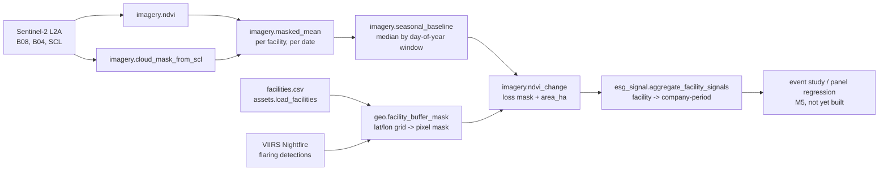

# Design

How the pieces fit together, and the two reference tables (Sentinel-2 bands,
SCL classes) the code in `imagery.py` assumes without restating.

## Pipeline

Everything left of `esg_esg_signal.aggregate_facility_signals` operates on one
facility at a time; everything right of it operates on a panel of
company-periods. That boundary is also the `requirements-geo.txt` boundary --
nothing past "pull the pixels for this buffer" needs a geo library, and
nothing before it needs anything but numpy.

## Sentinel-2 L2A bands used here

| Band | Name | Resolution | Used for |
|---|---|---|---|
| B04 | Red | 10 m | NDVI red input |
| B08 | NIR | 10 m | NDVI NIR input |
| SCL | Scene Classification Layer | 20 m (resampled to 10 m) | cloud/shadow/snow masking |

Sentinel-2 ships several other 10-20 m bands (blue, green, red edge, SWIR)
that are not used by anything in this repo yet; a vegetation-stress index
beyond plain NDVI (e.g. NDRE using the red-edge bands) is a plausible later
addition, not a current dependency.

## Scene Classification Layer (SCL) codes

| Code | Class | Kept by `cloud_mask_from_scl` default? |
|---|---|---|
| 0 | No data | no |
| 1 | Saturated or defective | no |
| 2 | Dark area pixels | no |
| 3 | Cloud shadows | no |
| 4 | Vegetation | **yes** |
| 5 | Not vegetated (bare soil) | **yes** |
| 6 | Water | **yes** |
| 7 | Unclassified | no |
| 8 | Cloud, medium probability | no |
| 9 | Cloud, high probability | no |
| 10 | Thin cirrus | no |
| 11 | Snow / ice | no |

The default `keep=(4, 5, 6)` is a whitelist of land/water classes that a clean
NDVI reading is possible over. It excludes thin cirrus (10) even though it is
sometimes treated as usable in other pipelines, because a thin-cirrus pixel
can still depress NIR reflectance enough to bias a loss detector toward false
positives -- worth revisiting once there is a real false-positive rate to look
at (M4).
